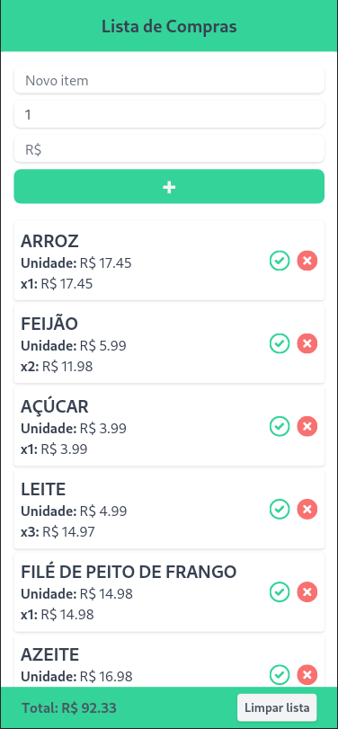

# Lista de Compras com React e Tailwind

## Uma simples aplicação para a criação de listas de compras utilizando React e Tailwind.

- Persistência de dados com localStorage
- Mobile first
- Simples e efetiva

---

### [ACESSE AQUI](https://minhalistadecompras.netlify.app/)

---

---

## Utilização:
>
> ### Inserindo um novo item:
> - Digite o nome do item (obrigatório)
> - Digite a quantidade (não obrigatório)
> - Digite o valor unitário do item (não obrigatóio)
> - Pressione o botão :heavy_plus_sign:
> ### Editando um item:
> - Pressione um item para editá-lo
> ### Excluindo um item:
> - Pressione o ícone :x: no item para excluí-lo
> ### Marcando um item no carrinho:
> - Pressione o ícone :heavy_check_mark: no item para marcá-lo
> ### Exlcuindo a lista inteira
> - Pressione o botão "Limpar lista" no canto inferior direito
